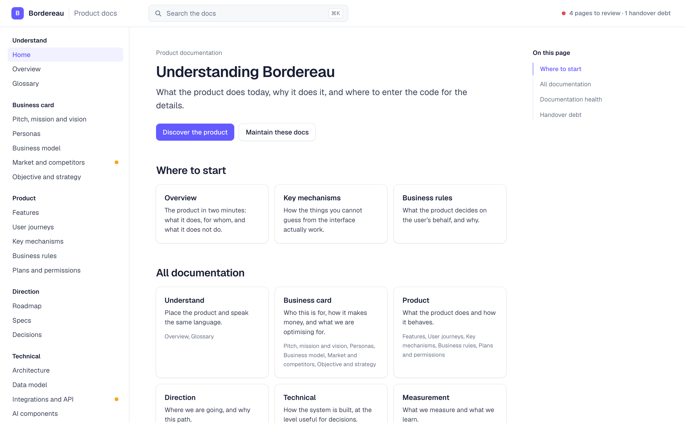
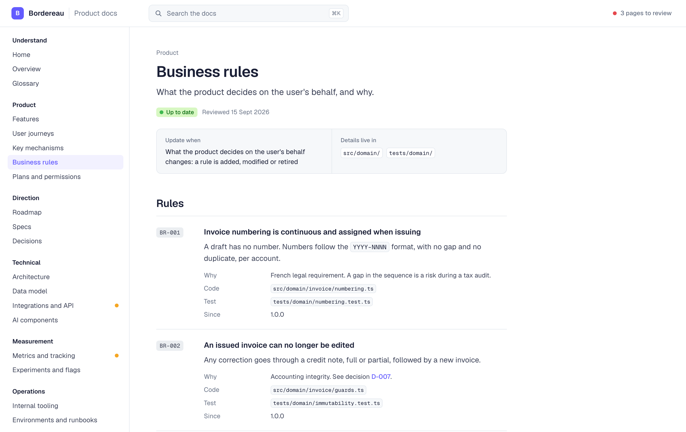
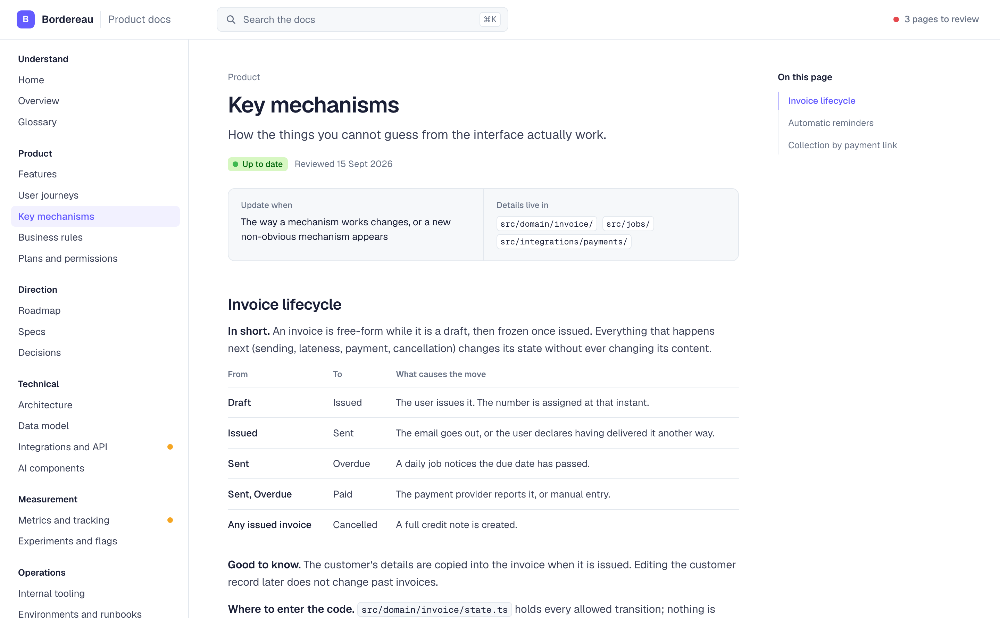
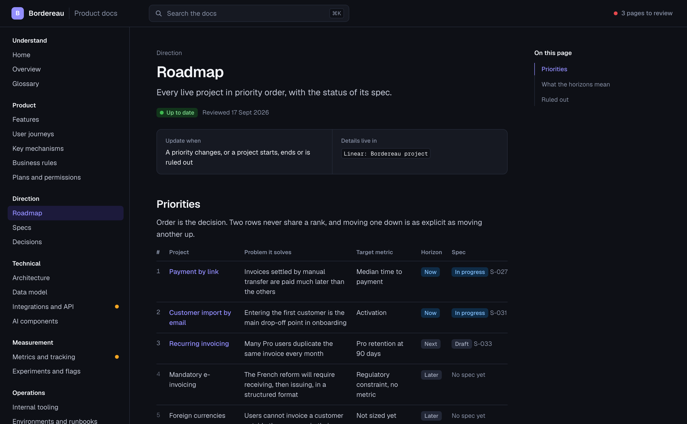
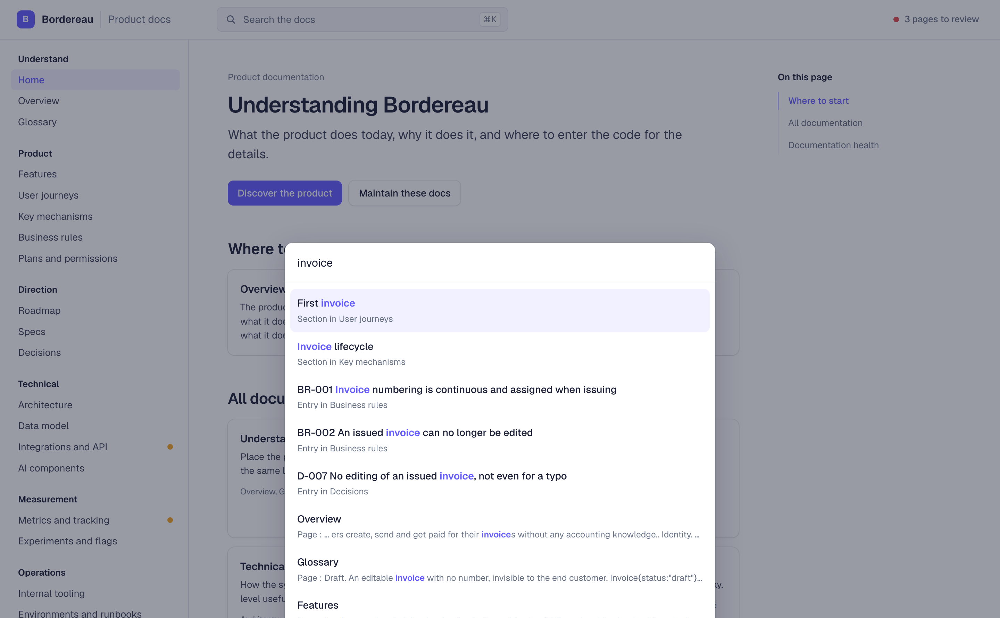
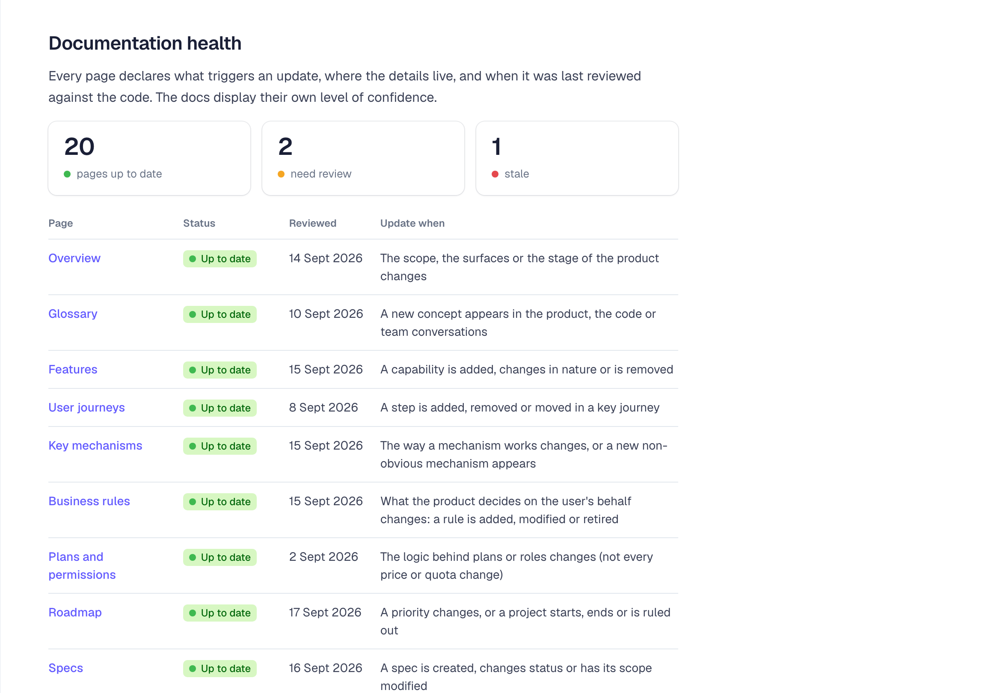

# 📚 product-docs

Two Claude skills that write — and then keep true — the product documentation of a codebase. One
self-contained HTML page, versioned next to the code, that explains what the product does, how its
mechanisms actually work, and **why** the business rules are what they are. 🧠

Because here's the thing: a repository holds the *what* and the *how*. It almost never holds the
*why*. Grep will tell you that invoices can't be edited after issuing. It will never tell you that
it's an accounting-integrity decision taken in March, and that the credit note is the way out. 🕳️

So these skills are built around one uncomfortable rule: **a docs page full of plausible invented
reasons is worse than no docs at all.** The bootstrap skill never guesses a reason — it asks you,
and writes `Why: to be confirmed` when you're not there. ✋

| Skill | What it does |
|---|---|
| 📖 `product-docs-bootstrap` | Creates `docs/product/index.html` from scratch — explores the repo, gets the inventory reviewed by you, then writes |
| ✏️ `product-docs-update` | Keeps it true — surgical edits in the same commit as the code, plus a full audit pass against the codebase |

## 🚀 Quick start

Two steps, about a minute. ⏱️

**1. Install both skills** — in Claude Code:

```bash
git clone https://github.com/guillaumesimon/product-docs-skill /tmp/product-docs-skill && cp -r /tmp/product-docs-skill/product-docs-bootstrap /tmp/product-docs-skill/product-docs-update ~/.claude/skills/
```

**2. Restart Claude Code, open a repo, then just ask:**

```
Write the product documentation for this project
```

It explores the repository, hands you an inventory to correct, and only then writes. Later, after
any change that alters how the product is understood:

```
Update the product docs
```

That's the whole loop. 🔁

## 📸 What it looks like

Every screenshot below is the worked example that ships with the skill — *Bordereau*, a fictional
invoicing product for French freelancers. It's what the template is filled with before your content
replaces it, so it doubles as a depth-and-tone reference. 🎯

### One page, a real sidebar, real search



### The page that earns the whole thing: business rules

An identifier that never gets reused, the intent in one verifiable sentence, **the why**, the file
that implements it, and the test that proves it. Without this page those rules only exist as
scattered `if` statements. 🔒



### Mechanisms, one screen each

In short / how it unfolds / special cases / why it's built this way / where to enter the code. If it
runs past a screen, you're copying the implementation and the skill says so. 🧩



### A roadmap that reads itself (and yes, dark mode 🌙)

One row per live project, in priority order. Rank, project name and spec status are generated from
the spec pages — you write the problem, the metric and the horizon. Reordering the rows *is* how
priority changes.



### Every spec ships with its announcement 📣

Each spec page carries a **future changelog**: the two or three lines users will read on release
day, with emoji, written from what they gain rather than from what we built — *before* the build
starts. It doubles as a benefit test: a project nobody can announce in three lines is a project
whose value isn't settled yet. On shipping, that block becomes the Changelog entry, so release day
is a copy rather than a writing exercise. ✨

### Nothing ships without its handover 🔁

The commonest way these docs rot: a project ships, and Features still says *planned* while Key
mechanisms has never heard of it. So every spec lists the pages it will have to feed — written with
the spec, not on release day. When your change makes that behaviour real (a flag removed, a gate
deleted), the update skill moves each line into its target page, in that page's own shape, and ticks
it with the date. A spec isn't shipped until every line is ticked, and a shipped spec with open
lines shows up as **handover debt** on the home page, under the project's name. 🚨

### ⌘K search across pages, rules, decisions and sections



### Docs that display their own confidence 🚦

Every page declares what triggers an update, where the details live, and when it was last checked
against the code. The register on the home page is the dashboard — and the header shows the count of
pages needing review at all times. Stale docs stop being invisible.



## 🧠 The one rule that shapes everything

**Explain, do not copy.** ✂️

Anything you can get with a database query or by opening a file does not belong in the docs: column
lists, event lists, prices, quotas, flag states, metric values, endpoints, environment variables,
exact constants. Explain the principle, the reason and the pitfalls — then cite the file where the
detail lives.

| ❌ Copied | ✅ Explained |
|---|---|
| `status: draft \| issued \| sent \| overdue \| paid` | An invoice is free-form while it's a draft, then frozen once issued. `src/domain/invoice/state.ts` holds every allowed transition |
| Pro: 29€, 200 invoices/month | What each plan is *for*, and what happens when you hit the limit. The grid lives in the billing config |
| A list of all 47 tracked events | The tracking convention and the three events that actually matter. The rest is in the taxonomy |

The test for any page: after reading it, you know which file to open and you understand what you
read there. Copying makes docs stale within a week and adds nothing `grep` wouldn't give you. 🔍

## 📖 How bootstrap works

It runs in passes, with you in the loop for everything the code cannot tell you. 🔄

**Pass 1 — inventory, and nothing else.** A single agent reading a whole repository loses precision
as its context fills, and the last territory explored is always the thinnest. So it fans out: six
agents in parallel — Surfaces, Domain, Mechanisms, Data, Dependencies, Operations — each writing a
fragment that gets merged into `docs/product/INVENTORY.md`. Every agent returns **observed** and
**inferred** separately, and none of them is allowed to invent a reason. 🕵️

Then it stops and asks you to correct the inventory. **This review is where the value is.** Thirty
minutes of your time here prevents a plausible but wrong documentation that everyone will believe
for months. ⏳

**Pass 2 — writing, in batches.** Overview + Glossary + Features, then Key mechanisms + Business
rules, then the technical pages, then the rest. It stops after each batch. Batches 1 and 2 carry
most of the understanding — if you want something useful fast, do those two and stop. 🛑

**Pass 2b — the critique team.** A draft written from an inventory always carries three defects its
author can't see, so three agents go at it before you ever see it, none allowed to edit:

- 🔎 a **copy detector** that hunts content copied rather than explained
- 🧾 a **reason auditor** that traces every "why" back to the inventory, and flags the ones that
  trace back to nothing — those become `Why: to be confirmed`
- 🆕 a **newcomer test** that reads *only the docs, never the repo*, tries to answer five real
  questions, and reports what it couldn't

That last one is the interesting one. The questions it can't answer point at your thin pages — and
surprisingly often at a genuine gap in the team's understanding of its own product. 💡

**Pass 3 — wiring the maintenance.** Docs nothing maintains go stale in a fortnight, so it appends a
block to your `CLAUDE.md`, adds one line to the PR template, and tells you a weekly review can be
scheduled. 🔧

**Starting from nothing?** There's a greenfield path too: no code to inventory, so the content comes
from an interview instead. 🌱

## ✏️ How update works

It starts by *not* touching the docs. One question:

> **Would someone who read the docs yesterday misunderstand the product today because of this change?**

If no — stop. Most commits change values, columns, events, styling or implementation without
changing how the product is understood, and the docs are deliberately silent about all of that.
Editing them anyway trains everyone to skim a page that changes for no reason. 😴

If yes, a change map says exactly which pages are in scope:

| If the change | Update |
|---|---|
| Makes a spec's behaviour real — a flag removed, a gate deleted, a job switched on | That spec's handover, line by line |
| Changes what the product decides on the user's behalf | Business rules, Glossary if there's a new term |
| Changes how a mechanism unfolds, or adds a non-obvious one | Key mechanisms |
| Adds an external dependency, or changes outage behaviour | Integrations, Architecture, Security if personal data |
| Settles a structuring choice, product or technical | Decisions |
| Only changes values, columns, events, prices, quotas, styling or implementation | **Nothing** |

Each page also carries its own contract: `data-trigger` says what that page reacts to, `data-sources`
says where the detail lives so you don't copy it. Touch a page and its `data-verified` becomes
today. Find a gap you can't resolve — the code says one thing, the page says another — and it's
flagged `check` with the gap described in one sentence at the top. **A flagged gap is useful; a
silent one rots.** 🚩

### 🤝 The handover pass

The one case that always answers *yes*. When the change in front of it makes a spec real, the skill
opens that spec and works its handover line by line: content into the target page, in that page's
shape and in the present tense, then the line ticked with today's date. It reports what moved, what
it left open and why. What it will not do is tick a line by writing something plausible — an open
line is visible debt, an invented paragraph is invisible damage. 🧾

### 🔬 The audit pass

Ask to review or refresh the docs and it fans out again: one agent per page, checking whether what
the page claims is still true of the code it points at, plus two cross-page agents that catch what
per-page checks can't — contradictions between pages, and what a newcomer still cannot answer. It
opens a pull request rather than pushing, and reports page / verdict / what changed. 📋

Contradictions get surfaced separately, because they usually mean the team is carrying two mental
models of the same thing. 🪞

## ✅ Before you start

- 🤖 Claude Code, the Claude desktop app, Cowork or claude.ai. Subagents make the exploration and
  audit passes much better, but every pass degrades gracefully into a sequence if you have none.
- 📁 A repository. Any stack — the skills read code, they don't run it.
- 🕐 About thirty minutes of your attention for the inventory review. That's the non-negotiable bit.

## 📦 Install

### Claude Code

```bash
git clone https://github.com/guillaumesimon/product-docs-skill
cp -r product-docs-skill/product-docs-bootstrap product-docs-skill/product-docs-update ~/.claude/skills/
```

Restart Claude Code — skills are read at startup. 🔄

Want them in one project only instead of everywhere? Copy into `<project>/.claude/skills/` instead.

### Claude desktop app (Chat tab), Cowork, claude.ai

Pre-built bundles are in [`dist/`](dist) — upload them as account skills from the skills panel in
settings:

```
dist/product-docs-bootstrap.skill
dist/product-docs-update.skill
```

Uploading a bundle whose name matches a skill you already have offers **Replace**, which saves a new
version and keeps the old one in the skill's version history. 🔁

Working from a clone and editing the skills? Rebuild the bundles with `./update-skills.sh`, or let
the hook do it for you:

```bash
git config core.hooksPath githooks
```

Then any commit touching a skill source rebuilds `dist/` and includes it. The hook also refuses a
`description:` over 1024 characters — the account skills panel rejects those, and Claude Code
doesn't, so it would only surface at upload time. ✂️

⚠️ The desktop app is two worlds at once and this trips everyone up: its **Code** tab is Claude Code
and reads `~/.claude/skills/`, its **Chat** tab uses account skills. Installing in one does not
install in the other. Use both? Install in both. 🚪🚪

## 💬 Using it

The skills trigger on their own when the situation calls for it, but saying it plainly always works:

```
Write the product documentation for this project
```

```
Il n'y a aucune doc sur ce repo, crée la doc produit
```

```
We're starting a new project — set up its product documentation
```

Then, as the code moves:

```
I just changed how reminders are scheduled — update the product docs
```

```
Add a spec page for the customer import project
```

```
Audit the product docs against the code and tell me what drifted
```

```
Record the decision we just took about not editing issued invoices
```

The update skill checks the docs exist first. If they don't, it hands off to bootstrap rather than
inventing a page. 🤝

## 🔁 Keeping it alive

This is the part everyone skips, and it's the part that decides whether the docs are alive in three
months. Bootstrap wires all three automatically: 🪝

1. **A block in `CLAUDE.md`** (or `AGENTS.md`) — the copy is in
   [`product-docs-bootstrap/assets/claude-md-block.md`](product-docs-bootstrap/assets/claude-md-block.md).
   It tells every future agent to read the docs before touching an area it doesn't know, and to ask
   the one question before closing a task.
2. **One line in the PR template** — *Does this change how the product is understood? If so, docs
   updated.*
3. **A weekly review**, scheduled if you want it. The audit pass is designed to run on a schedule.

The documentation is part of the definition of done, in the same commit as the code. Not a Notion
page someone will archive in June. 📅

## 🗂️ What's in here

```
product-docs-bootstrap/
  SKILL.md                        the skill itself
  assets/template.html            the page you copy — self-contained, ~1200 lines,
                                  filled with the Bordereau worked example
  assets/claude-md-block.md       the block appended to CLAUDE.md
  references/page-catalog.md      each page: purpose, what belongs, what doesn't,
                                  where to find the material in a repo
  references/agent-teams.md       exploration, writing and critique teams: exact prompts
  references/greenfield.md        the interview, for a project that doesn't exist yet

product-docs-update/
  SKILL.md                        the skill itself
  references/change-map.md        which change updates which pages + the full writing rules
  references/handover.md          shipping a spec: moving its content into the living pages
  references/audit-team.md        the audit team: per-page and cross-page prompts, verdicts

dist/                             pre-built .skill bundles for Chat / Cowork / claude.ai
                                  (plain zips - the panel takes .zip or .skill)
update-skills.sh                  rebuild the bundles, link ~/.claude/skills at this
                                  checkout, open the Skills panel
githooks/pre-commit               rebuilds dist/ whenever a skill source is committed
docs/screenshots/                 the images above
```

The template is **one HTML file** — no build step, no dependency, no server. Navigation, search, the
spec index, the roadmap ranks and the health register all generate themselves from the page
metadata. Open it with a double-click, commit it with the code, diff it in a PR. 📄

## 🚧 Known limits

- 🧑‍⚖️ **It cannot invent the why, and it won't pretend to.** Skip the inventory review and you get
  a correct-but-shallow documentation full of `Why: to be confirmed`. That's the design working, not
  failing — but the docs are only as good as the half hour you give them.
- 🗺️ **Roadmap, Specs and Decisions can't be derived from code.** The skill leaves the structure and
  says plainly what's left for you.
- 📏 **It's opinionated about what a business rule is.** Format validations and technical defaults get
  rejected. A business rule is something a user or a support agent could argue about.
- 🌍 **English by default**, whatever language you're chatting in, because the docs get read by agents
  and by people who may not share your team's language. Ask for another and it follows, and records
  the choice so later updates stay consistent.
- 🏗️ **Single page, single file.** Great up to a few dozen pages and a handful of specs. A product
  with three hundred specs wants a different tool.
- 🔀 **Agents never write into `index.html`** — they produce fragments that get assembled. That's
  deliberate: concurrent edits to one file silently drop content.

## 🛠️ Making it yours

- ✂️ Delete pages you don't need. The skill already does this, but the catalog in
  `references/page-catalog.md` is where you'd change the defaults. An empty page is worse than a
  missing one.
- 🎨 The template's colours are CSS variables at the top of `template.html`, light and dark. Swap the
  accent, keep the rest.
- 🗣️ Change the language rule in `SKILL.md` if your team writes docs in French, or German, or
  anything else.
- 👥 Resize the exploration team in `references/agent-teams.md` — six territories is a default, not a
  law. Drop the ones that don't apply to your project.
- 🧪 Tighten or loosen the change map in `references/change-map.md`. The last row — *only changes
  values, columns, prices, styling or implementation → **nothing*** — is what stops the docs from
  becoming noise. Touch it last.

## 🗓️ Changelog

### 20 September 2026

- 📦 `./update-skills.sh` rebuilds the bundles and installs them in one go
- 🔁 Specs hand over to the living pages, line by line, when they ship
- 🚨 A shipped project that never updated the docs shows as debt on the home page
- 🤖 The agent moves the content itself, then tells you what it couldn't source
- 🔒 No spec gets marked shipped while a line is still open

### 19 September 2026

- 📣 Every spec now ships with the release note users will read
- ✅ Can't announce it in three lines? The value isn't settled yet
- 📋 Release day becomes a copy-paste, not a writing exercise
- 🔎 The audit flags specs whose promise no longer matches their scope

### 17 September 2026

- 📚 Product docs that live in the repo, in one file you double-click
- 🤖 Bootstrap writes them from your code, update keeps them true
- 🚦 Every page says when it was last checked against the code
- 🔒 Business rules keep their *why*, so nobody undoes them by accident
- 🗺️ A roadmap that ranks itself from the spec pages

## 🙏 Credits

Built by [Guillaume Simon](https://guillaumesimon.app), with Claude. 👋

The worked example in the template — *Bordereau* — is fictional. Any resemblance to your invoicing
tool is a coincidence, and probably a compliment. 🧾
